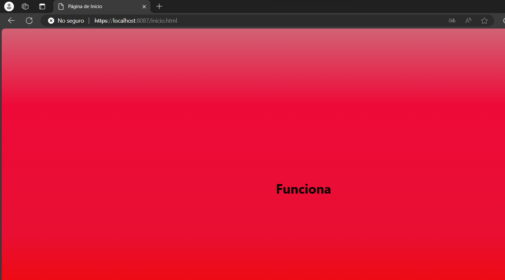

# AREP-Taller-7

En este taller se tuvo como objetivo realizar un servidor web utilizando Spark que implementara llaves privadas para mantener la seguridad de las peticiones.

## Para ejecutar el programa

Se puede hacer uso del comando git clone y usar la URL del repositorio:
```
https://github.com/jacro103/Arep_lab07.git
```

## Prerequisitos

Es necesario tener instalado maven para compilar y probar los test del programa, si no se tiene maven puede instalar [aqui](https://maven.apache.org/install.html).

## Despliegue del programa:

Es necesario ejecutar el comando:

```
mvn clean compile
```

```
mvn exec:java '-Dexec.mainClass=com.mycompany.arep_lab07.LoginService'
```
```
mvn exec:java '-Dexec.mainClass=com.mycompany.arep_lab07.User'
```

Este comando debe ser ejecutado en dos directorios, el primero LoginService y el segundo User


## Descripcion del programa:

### Diseño:

En este programa se usa la clase LoginService.java para dar un login a los usuarios y una vez identificados se conectara con el otro servidor para solicitarle un servicio.

### Implementacion:

#### Desarrollo servidor:

Para empezar tenemos la clase LoginService.java que recibe las peticiones y retorna la pagina principal o utiliza la clase HttpConnectionExample.java para realizar las peticiones a alguno de los servicios.<br>

<br>

Cuando un usuario se autentica correctamente LoginService hace un llamado a OtherService con al finalidad de que le retorne la informacion al usuario, en este caso es una simple pagina. Para probar la funcionalidad el único usuario registrado es juan con contraseña 123.<br>

<br>


#### Manejo de llaves y encriptado:

Para el ejercicio se crearon llaves privadas, las cuales estan en el directorio keystore de ambos servidores. Si comentamos el codigo donde le asignamos su llave a User.java e intentamos realizar el llamado podemos ver que se genera la siguiente error debido a que no tiene la llave en la que LoginService confia.

Las contraseñas de los usuarios son encriptadas desde el javaScript de la pagina index.html para garantizar que no se conozcan las contraseñas.


#### Video: 
[Video](https://pruebacorreoescuelaingeduco-my.sharepoint.com/:v:/g/personal/jose_correa-r_mail_escuelaing_edu_co/EUrC3QY9EplOrHUqyfMsFb0BzQSgr_WBSt8TH2rQSzx32w?e=ZhySgy&nav=eyJyZWZlcnJhbEluZm8iOnsicmVmZXJyYWxBcHAiOiJTdHJlYW1XZWJBcHAiLCJyZWZlcnJhbFZpZXciOiJTaGFyZURpYWxvZy1MaW5rIiwicmVmZXJyYWxBcHBQbGF0Zm9ybSI6IldlYiIsInJlZmVycmFsTW9kZSI6InZpZXcifX0%3D)

## Construido con:

* [Maven](https://maven.apache.org/) - Manejo de dependecias.

## Autor

* Jose Alejandro Correa Rodriguez